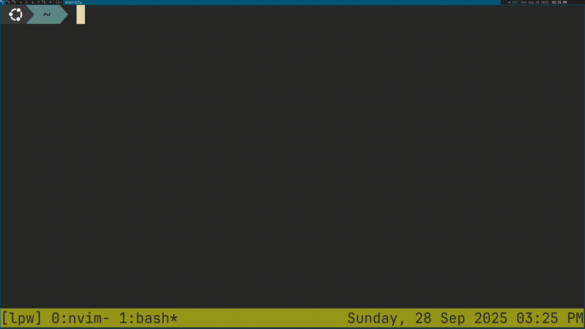

# 🖨️ LPW
Line Print Wrapper for Linux and Mac.



## ⭐ Features
* 🖨️ Seamless integration with lp
* 🔧 Easily set printing parameters
* 💻 Fancy command line interface

## 📦 Installation
To install on Linux, run this script:
```
sudo wget https://raw.githubusercontent.com/Kolin63/lpw/refs/heads/main/lpw -O /usr/bin/lpw
sudo chmod +x /usr/bin/lpw
```
To install on Mac, place the `lpw` script file somewhere that is in your path.

## 📖 Usage
Since LPW is a wrapper of lp, there are few arguments that are unique to LPW.
The most minimal way to run LPW is by only providing the file name. For
example: `lpw file.txt`. However, more arguments can be passed that will be set
when the file is printed. For example: `lpw -n 5 file.txt` will print 5 copies.

One LPW is opened, you will see a text interface. You will have the options to
set the amount of copies, which pages will be printed, if it should be double
sided, or to add any parameter.

Once you have finished changing the settings, you can finish by selecting
'Done' and confirming the print. You will also have the option to cancel the
print and continue changing the settings.

## 🔧 Configuration
LPW checks for a configuration file at `~/.lpw` A different config file can be
specified with the `-u` parameter.

The format of a configuration file is a list of parameters that will be passed
to lp. The parameters can separated by spaces or new lines.

This is an example configuration that sets all margins to 0:
```bash
-o page-top=0
-o page-right=0
-o page-bottom=0
-o page-left=0
```
